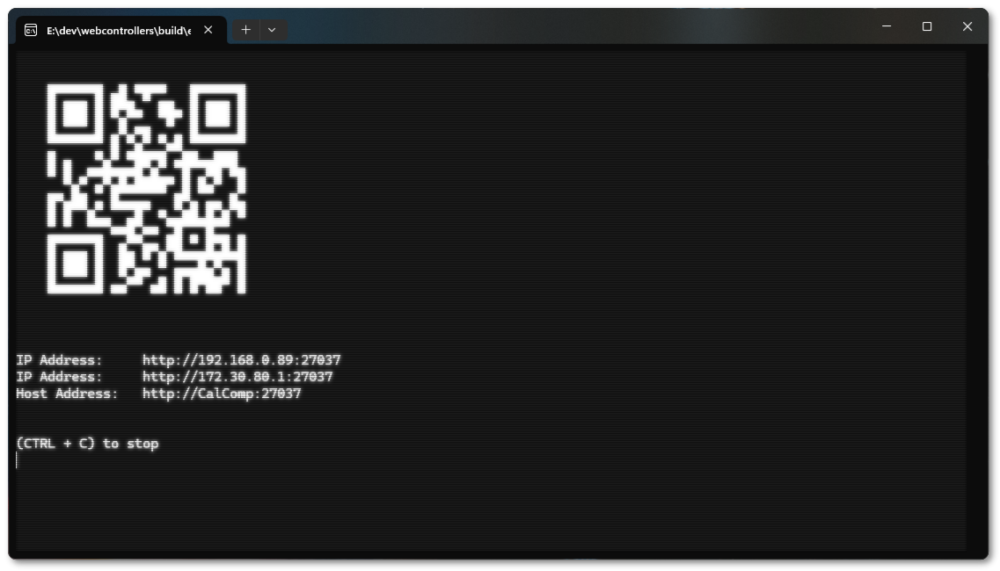

    

# Web Gamepads
Web Gamepads is a solution for couch co-op gaming without everyone needing a physical controller. The program acts as a server that enables PCs to support multiple browser-based controllers, i.e. playing a PC game using a smartphone as a "virtual" controller. This eliminates the requirements for physical controllers when playing co-op games, although it may not be ideal for fast-paced first-person shooter games due to potential input lag issues and touchscreens being less ergonomic than actual controllers, but it should work great for couch co-op games like overcooked.

Provided as is and with no guarantees, this was a simple side project to solve a problem that I've seen time and time again when friends get together but are limited in game choices as they have a keyboard and maybe one controller but don't have enough controllers for a couch game like "Overcooked", "Gang Beasts" or "Ultimate Chicken Horse".

[Demo Video](https://github.com/user-attachments/assets/ff383683-ee92-4c06-9740-3bfba4b9f6dd)

## Installation

Requires [nefarius/ViGEmBus](https://github.com/nefarius/ViGEmBus/releases) to be installed (no longer maintained project, will look into finding a replacement).

Download the provided EXE and run, console window will appear and display the address and port number for phones to connect to including a handy QR code with the first IP address available.

## Usage

Simply download the zip file and run the `app.exe`.
change settings in the `settings.ini` notably the maximum number of controllers is changed here, `max_controllers = 2` can be changed to `max_controllers = 4`. XInput only supports 4 controllers by default, however if a game uses steam input api and the Xbox Extended Feature Support Driver is installed, then 4+ controllers should work, testing showed crashes above 16.

On the client side the drop down with the number lets you pick which controller you are using.
The settings menu allows you to rearrange and hide elements of the controller, e.g. you don't need the right thumbstick if playing overcooked. The `Add Controller` button creates a new controller on the server and refreshes the list of available controllers to all clients.

# Development
Contributions are what make the open source community such an amazing place to learn, inspire, and create. Any contributions you make are greatly appreciated.

If you have a suggestion that would make this better, please fork the repo and create a pull request. You can also simply open an issue with the tag "enhancement". Don't forget to give the project a star! Thanks again!

## Technical Details

The program is a Python flask server (`app.py`) using Flask-SocketIO to connect with a pure javascript html page using Socket.IO (`gamepad.html`). It's a very bare bones solution as a minimum viable solution,  taking either button presses or joystick movement from the client and directly altering the controllers on the server side and assuming Socket.IO will ensure the correct order is received and handle the connection logic. Icon graphics are provided by ["Xelu", founder of Those Awesome Guys](https://thoseawesomeguys.com/prompts/) CC0 assets.

## Roadmap

- [ ] Find an alternate solution to ViGEmBus
- [ ] Hotswap at runtime from client i.e. add/remove controllers
- [ ] Save controller configurations on the server side and/or provide profiles for games with max controllers
- [ ] Linux/steamdeck support (Currently windows only)

Possible work that could improve the app.

## building from source
Assumes Python is installed
1. Create a python virtual environment `python -m venv venv`, use `pip install virtualenv` if venv is not installed
2. Install requirements.txt `pip install -r requirements.txt` to install dependencies
2. Run `app.py` as is or create a `.exe` using cx_freeze `python setup.py build`
